# Migration to ORM
This project is meant to explore the advantages and disadvantages of using an ORM framework and experiment with connection pools. I chose Hibernate as my ORM framework and HikariCP as the connection pool. I presented below a code boilerplate comparison together with a benchmark of using a connection pool VS without one.

---

## Code boilerplate comparison (with and without ORM)

Below is a comparison of the code boilerplate generated by Hibernate and the code generated by the ORM. In some cases (the get-all case) it reduces the code by a bit, but in other cases the code stays almost the same.

### Get all customers method:

    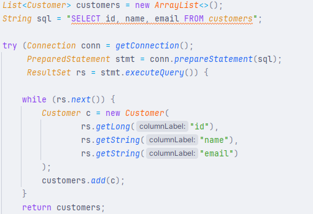
    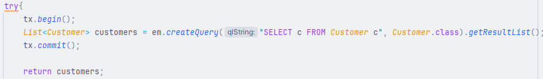

### Get all orders method:

    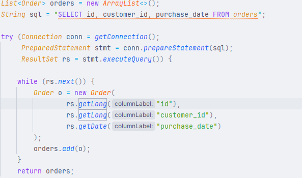
    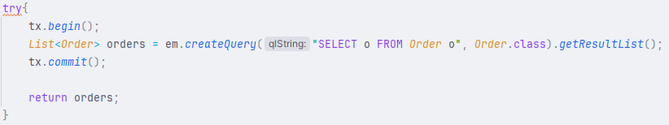

### Add order method:

    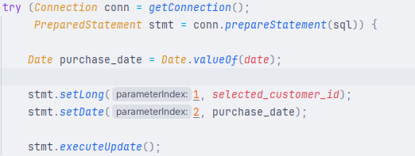
    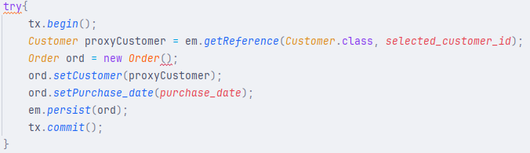

### Update order method:

    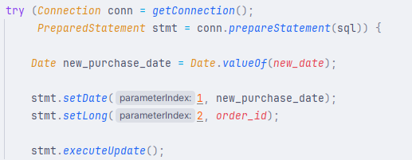
    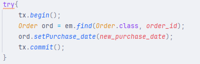

### Delete order method:

    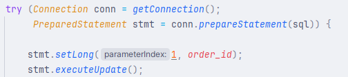
    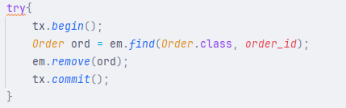

---

## Advantages and disadvantages of ORM

A few advantages of using ORM are that it reduces the code boilerplate (amounts of code written by the programmer). It also hides SQL code, so the programmer doesn't need to actually know SQL to communicate with the database. Another advantage might be that it also provides an added layer of correctness, i.e., you can only work with entities that are modeled to look like the tables inside the database, so errors coming from writing incorrect SQL queries is gone.

Some disadvantages that I know about are that it introduces an extra step of setting up Hibernate (or any other ORM framework). It can also in some cases be slower than writing SQL queries directly. And the fact that it hides the generated SQL code can be a problem if you design the code poorly.

---

## Problems encountered during migration

I encountered problems during the setup with the persistence.xml config file ( to be more precise in setting up the url and the password for my postgres database). I also had a problem on getting the id of the customer from the order I was loading from the database. My original thought process was that I need to switch the loading of the customer from lazy to eager to get my hands on the customer id. But it turns out that Hibernate saves the id (or the foreign key in a general case) inside a proxy object (an object created by Hibernate extending from the referenced class containing only the foreign key data and the current context, if I understood it correctly :)) ). 

---

## Connection overhead (100 connections without pooling VS 100 connections with pooling):

We can see based on the result that achieving 100 connections with a connection pool is around 6000 times faster than achieving 100 connections without a connection pool. Because of the overhead of creating a new connection to the database every time we need to communicate to the database, it is recommended that we use a connection pool if we need to create a lot of connections. What a connection pool does is that at first it creates the number of connections specified by the user, and then every time you need a new connection, it reuses the unused ones (the "closed" connections).

    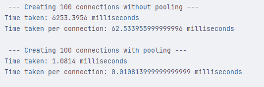

---

## Connection leak experiment

Image showcasing what happens if we don't close the connection in the pool. The pool sees that there are no available connections to "rent" and it can't create a new connection, so it needs to wait for an ammount of time specified by the user to see if a connection has been closed. After that time passes and no connections are broken, it throws an error shown in the experiment. By closing the connections when they should be closed, this behavior is avoided.

    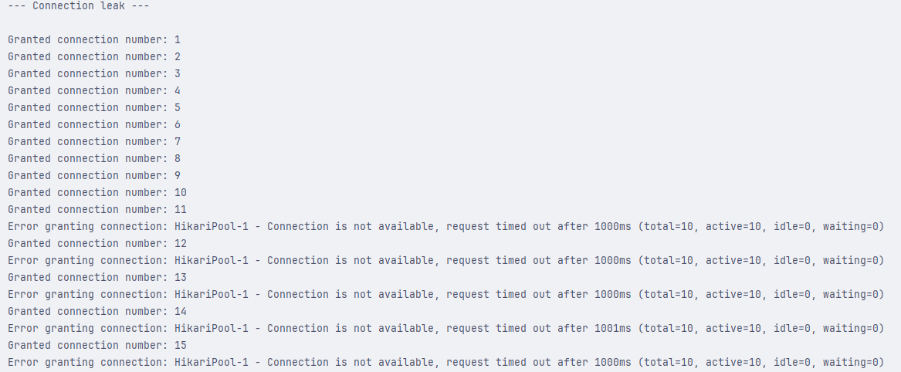
    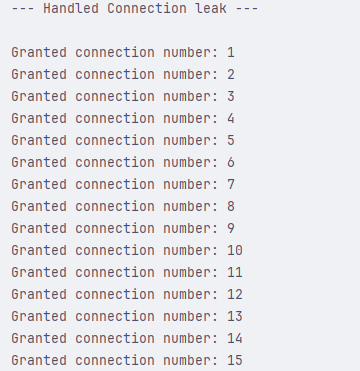

---

