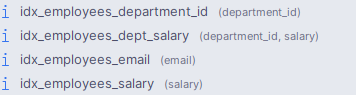
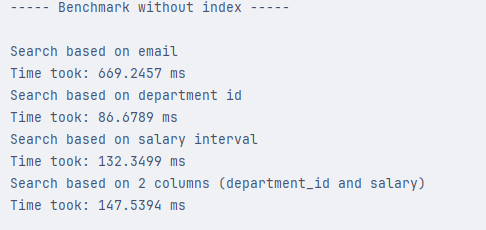
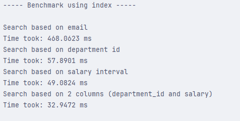
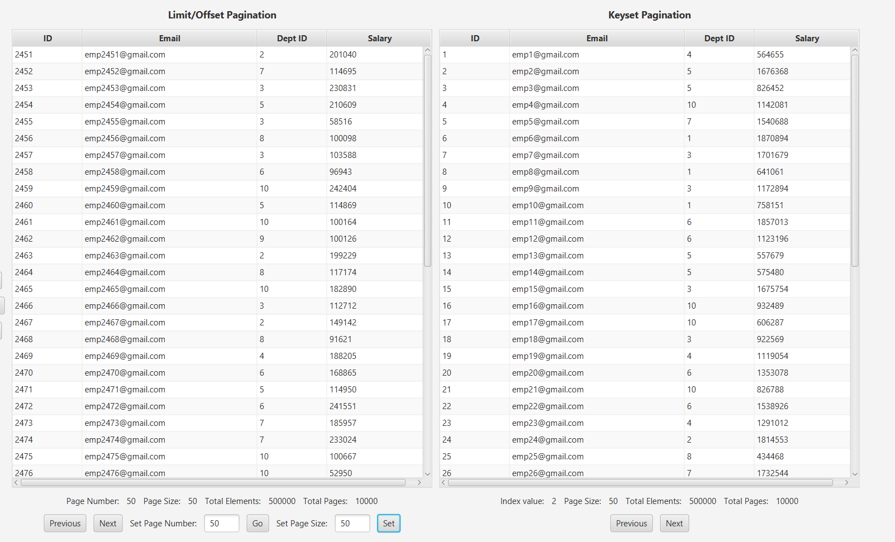
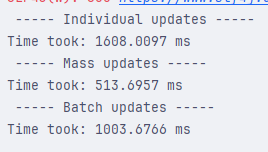
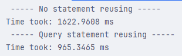

# Performance optimization project
I chose this project because I wanted to study the performance hits inside a database based on these scenarios: 
* How can indexes help in query optimization and performance.
* How paging with Limit/Offset and keyset can improve data fetching.
* How caching can boost performance inside java code using EhCache.
* How batching (on insert and update) reduces time complexity.

## Benchmarking with and without indexes

In this section my main focus was to showcase the importance of using indexes. While they can introduce extra space for storing the index and raise time complexity for inserting and updating (the database has to insert and update the indexes too, not only the database records), they speed up searching the database considerably. I worked on the Employees table with 500.000 records and did 4 types of searches:
* Search by email
* Search by department_id
* Search by salary range
* Search by 2 columns

#### Here are the indexes i've created:

    

#### Here are the results:

    <h3><strong>Results without indexes:</strong></h3>
    
    <h3><strong>Results using indexes:</strong></h3>
    

| Search criteria                              | No Index (ms) | With Index (ms) | Decrease(%) |
|:---------------------------------------------|:-------------:|:---------------:|:-----------:|
| Email (email = `emp159735@gmail.com`)        |    669.24     |     468.06      |   30.06%    |
| Department ID (department_id = `5`)          |     86.67     |      57.89      |   33.20%    |
| Salary range (salary = `50k - 60k`)          |    132.34     |      49.08      |   62.91%    |
| 2 columns (dept_id = `5` & salary > `50000)` |    147.53     |      32.94      |   77.67%    |

## Paging (Limit/Offset and Keyset)

While both present advantages and disadvantages, the winner of these approaches is the Keyset one because it is more resilient, i.e. it resists to updates and deletes without breaking the view of the page like the limit and offset strategy. While the winner is all set, there are some advantages in using the limit/offset approach because it offers an easier implementation and clearness.

    

## Caching (EhCache)

# TODO: add doc

## Mass operation optimization

In this experiment I ran 3 different strategies for updating 10000 employees' salary. The strategies are as follows:
* Individual updates: For every employee we create a new query to update it
* Mass update inside the database: We send only one query to the database, and the engine inside handles the update.
* Batch updates: We group updates in sizes of 200 and send them in a group to the database.

The fastest one is the update query inside the database because we only send one query through the network and the database engine is optimized to handle the query efficiently. The second fastest is the batch update because we only send a small number of updates, so we reduce the network overhead. The slowest out of them is the individual updates because for every employee it has to sent the update query through the network.

    

## The N + 1 problem

In this section I provided a demonstration of what happens if we don't use the Join Fetch instruction. 
* In the first example the query executes once, and for every .getOrders() method call inside the loop, the ORM has to create a new query. 
* In the second example the first query fetches all the orders inside the Customer object using the Left Join Fetch operation.

#### First example:

    <h3><strong>Code:</strong></h3>
    
    <h3><strong>Result:</strong></h3>
    

#### Second example:

    <h3><strong>Code:</strong></h3>
    
    <h3><strong>Result:</strong></h3>
    

We can see based on the result that the first approach generates N (size of the Customers table) more queries than the second because the orders were not saved inside the customer object from the first query. As a result to this we have to query the database for every customer just so we can get the respective orders. This introduces unnecessary complexity and overhead to the code. The fix to this is showcased on the second approach where we load the orders for every customer from the first instruction.   

## Reusing statement

By avoiding creating an extra of 1000 queries that need to parse, validate and translate the text provided, we are gaining an extra 40% speed boost. We can reuse the same statement and just set the id parameter. The results are shown below.

    

